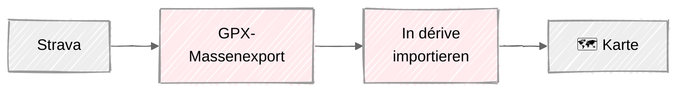
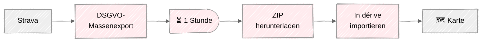
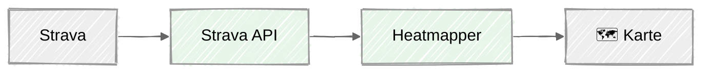
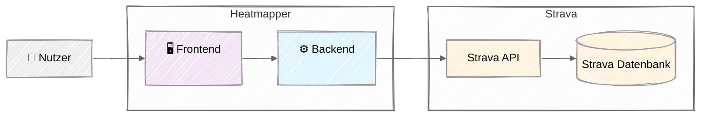
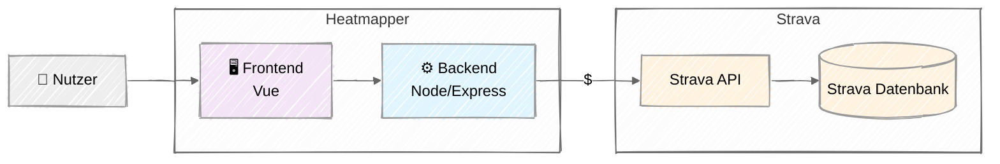
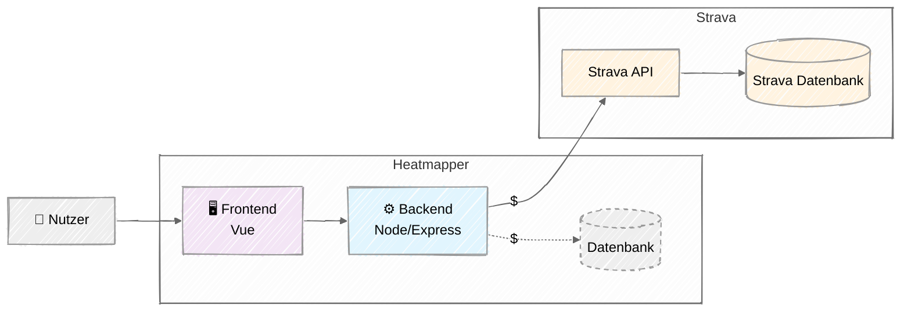
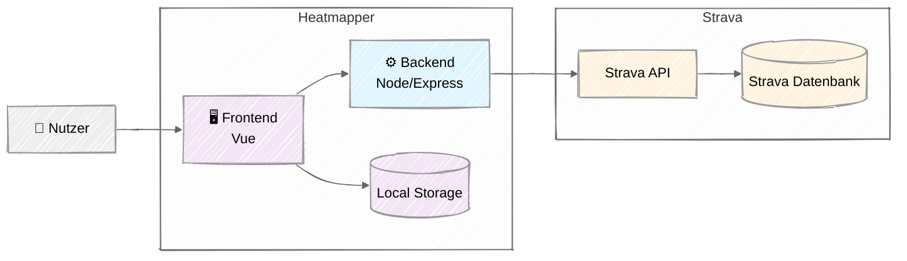
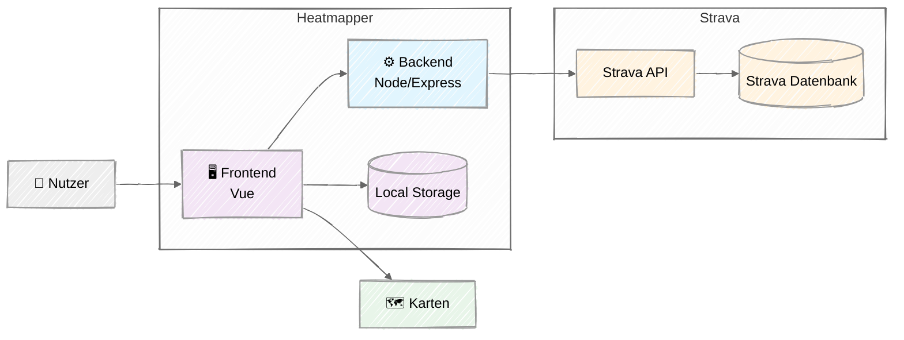
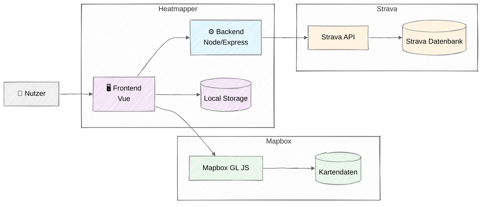

Von der manuellen Papierkarte zur programmatischen API-Integration

<!--
  Wir haben also das Problem erkannt.
  Aber *wie* wurde aus der analogen Papierkarte eine programmatische API-Integration?
-->

---
title: 'Der Wendepunkt: Von analog zu digital'
split: 60
right:
  image: /media/derive.jpg
  pageClass: bg-[position:33%]
  articleClass: text-white flex flex-col justify-end text-right
  full-color: true
---

### Der Auslöser

Entdeckung des Projekts <SmartLink to="github.com/erik/derive">**dérive**</SmartLink> — ein Open-Source-Projekt, das GPX-Dateien auf einer Karte darstellt

::blockquote{.font-serif.my-2}
**GPX**  
*GPS Exchange Format*. XML-basiertes Dateiformat für GPS-Tracks
::

::right::

(<SmartLink to="https://github.com/erik/derive"><mdi-github/> erik/derive</SmartLink>)

<!--
  Den ersten Anstoß hat mir dérive gegeben — ein Open-Source-Projekt, das GPX-Dateien auf einer Karte darstellt.
  Gefühlt war es genau das, was ich gesucht habe. Aber in der Praxis gab es ein Problem.
-->

---
title: Die Entscheidung für direkte API-Integration
articleClass: justify-around
---

<style>
.mermaid {
  text-align: center;
}
</style>

<div class="transition-opacity" :class="{ 'opacity-50': $clicks >= 2 }">

### GPX-Export (dérive)

<v-switch>
<template #0>



</template>
<template #1-3>



</template>
</v-switch>

</div>

<div v-click="2">

### Direkte API-Integration



</div>

<!--
  dérive basiert auf GPX-Dateien — man muss also seine Daten aus Strava exportieren.

  [click] Durch die DSGVO gab es aber nur noch einen Massenexport aller Daten – nicht nur GPX-Daten.
  Das heißt: eine Stunde warten, ZIP herunterladen, entpacken, importieren – auf dem Handy praktisch unmöglich.

  [click] Die bessere Lösung: Strava hat eine öffentliche API, über die man direkt auf seine Daten zugreifen kann.
  Ein Klick, kein Download, mobile-first möglich und automatische Updates.
-->

---
title: Erste technische Entscheidungen
split: 60
right:
  full-color: true
---

## Brauchen wir ein Backend? {v-click}

<v-click>

### Ja, aber minimal!

**Problem:** API-Tokens von Strava dürfen nicht im Frontend gespeichert werden

**Lösung:** Backend nur für Token-Management
- **Strava OAuth-Flow** abwickeln  
- **API-Token sicher speichern**
- **Session-Token** ans Frontend weiterreichen

</v-click>

::right::

<v-click>

## Architektur-Prinzip

### Backend: So wenig wie möglich

- Storage ist teuer, wenn die App skaliert

- Minimale Backend-Kosten

</v-click>

<!--
  Die API-Integration steht also als Richtung fest. Aber wie sieht die Umsetzung aus?

  [click] Die erste Frage war: Brauchen wir ein Backend?

  [click] Ja, aber so minimal wie möglich.
  API-Token dürfen nicht im Frontend gespeichert werden – das Backend übernimmt also nur den OAuth-Flow und das Token-Management.

  [click] Das Prinzip: So wenig Backend wie möglich, denn Storage wird teuer, wenn die App skalieren soll.
-->

---
title: Die Architektur im Überblick
articleClass: justify-center
---

<v-switch>
<template #0>



</template>
<template #1>



</template>
<template #2>



</template>
<template #3>



</template>
<template #4>



</template>
<template #5-6>



</template>
</v-switch>

<!--
  Schauen wir uns nun die Architektur an.
  Im einfachsten Fall brauchen wir nur ein Frontend, ein Backend und eine Verbindung zur Strava-API.

  [click] Als Frontend habe ich Vue.js gewählt, das Backend läuft in Node.js, sodass ich Code für Datenstrukturen zwischen Frontend und Backend teilen kann.

  Die Verbindung zu Strava hat ein Rate Limit – ich möchte also wiederholte Anfragen minimieren.

  [click] Ich könnte als Cache eine Datenbank ans Backend hängen, aber das würde bei Skalierung teuer werden.

  [click] Stattdessen habe ich Local Storage im Browser gewählt. Die Daten eines einzelnen Nutzers sind nicht besonders groß.

  [click] Außerdem brauchen wir Karten.
  Das war kurz nachdem Google Maps sein Preismodell umgestellt hatte – die Kosten pro Seitenaufruf sind um das 14-Fache gestiegen.
  Vielleicht erinnert ihr euch daran, wie plötzlich auf dutzenden Websites die Karten ausgegraut waren, mit der Meldung *„This page can't load Google Maps correctly."*

  [click] Strava selbst war vor kurzem auf Mapbox umgestiegen. Mapbox hat ein großzügiges kostenloses Kontingent, das ich bis heute nicht überschritten habe.

  So sieht also die fertige Architektur aus.
-->

---
title: Was liefert die Strava-API?
inner-split: 55
---

### Übersichtsdaten statt GPS-Tracks

Die API liefert eine **Liste von Aktivitäten** — paginiert, bis zu 200 pro Request.

<v-click>

### Encoded Polylines

Die Route ist als **Encoded Polyline** kodiert: Ein kompaktes Textformat, das GPS-Koordinaten stark komprimiert.

Perfekt für Kartenvisualisierung: kein Detail-Endpoint nötig. Eine Aktivität ist jetzt bspw. 1,5 kB statt 3,6 MB.

</v-click>

::right::

````md magic-move {at: 1}
```json
// GET /api/strava/activities?per_page=200
[
  {
    "id": 1234567890,
    "name": "Lauf am Abend",
    "type": "Run",
    "distance": 10234.5,
    "moving_time": 3542,
    "start_date": "2024-03-15T18:25:12Z",
    "total_elevation_gain": 123.4,
    ...
  },
  ...
]
```
```json {11-13}
// GET /api/strava/activities?per_page=200
[
  {
    "id": 1234567890,
    "name": "Lauf am Abend",
    "type": "Run",
    "distance": 10234.5,
    "moving_time": 3542,
    "start_date": "2024-03-15T18:25:12Z",
    "total_elevation_gain": 123.4,
    "map": {
      "summary_polyline":
        "ys~fHi}~s@bCxIjE`NpBxGx@..."
    },
    ...
  },
  ...
]
```
````

<!--
  Was bekommt man von der Strava-API?
  Keine GPX-Dateien – stattdessen kompakte JSON-Objekte, paginiert mit bis zu 200 pro Anfrage.

  [click] Das Herzstück: `map.summary_polyline` – eine Encoded Polyline, und die GPS-Koordinaten als kompakten String kodiert.
  Mapbox versteht dieses Format direkt. Es ist kein Detail-Endpoint nötig, die Datenmenge pro Aktivität schrumpft von Megabyte auf Kilobyte.

  ---

  [click] *Wie ist das möglich? Die Encoded Polyline nutzt eine Kombination aus Delta-Kodierung (nur die Unterschiede zwischen Punkten speichern) und Base64-ähnlicher Kodierung, um die Daten stark zu komprimieren. Die Punkte werden auch gefiltert: Wenn mehrere Punkte in einer geraden Linie liegen, werden die mittleren Punkte weggelassen, was die Datenmenge weiter reduziert. Außerdem fehlen Zeitstempel pro Punkt — es ist eine reine Geometrie, keine vollständige Aufzeichnung. Für eine Heatmap reicht das völlig aus.*
-->

---
title: Learnings – API-getriebene Architektur
---

<v-clicks>

- **APIs schlagen Datei-Exports** — direkter Zugriff ist robuster, nutzerfreundlicher und DSGVO-konformer

- **Nur das abrufen, was man braucht** — Summary-Daten reichen; kein Detail-Endpoint, keine riesigen Dateidownloads

- **Backend so minimal wie möglich** — Zustand gehört zum Client, nicht zum Server

- **Externe Abhängigkeiten haben Kosten** — Rate Limits, Pricing-Änderungen und Compliance-Anforderungen müssen eingeplant werden

- **Externe Änderungen erzwingen Anpassungen** — wer auf fremde APIs baut, baut auf fremden Entscheidungen. Kein Interface-Contract, kein SLA, der Pricing oder Datenstruktur festschreibt — Strava bestimmt.

</v-clicks>

<!--
  Fassen wir die wichtigsten Learnings zusammen.

  [click] APIs sind Datei-Exporten klar überlegen – robuster, direkter und unabhängig von manuellen Schritten.

  [click] Man sollte nur das abrufen, was man wirklich braucht. Summary-Daten mit Encoded Polylines reichen für eine Heatmap völlig aus.

  [click] Das Backend bleibt minimal – Zustand, der nur einen Nutzer betrifft, gehört in den Browser, nicht auf einen Server.

  [click] Externe Abhängigkeiten haben immer Kosten: Rate Limits, Gebühren, API-Versionierung. Das muss von Anfang an in die Architektur einfließen.

  [click] Und schließlich: Wer auf fremde APIs und Dienste baut, muss mit externen Änderungen rechnen – und die Architektur so gestalten, dass man darauf reagieren kann.
-->

