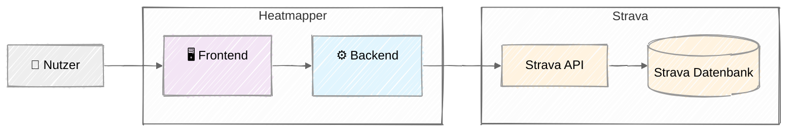
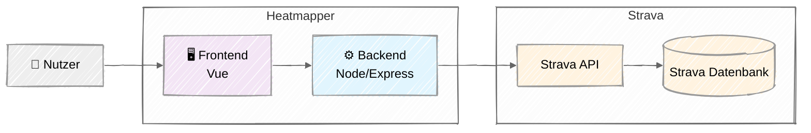
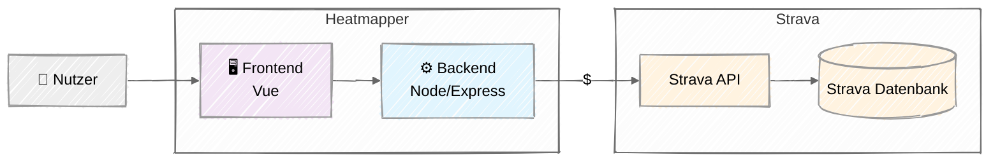
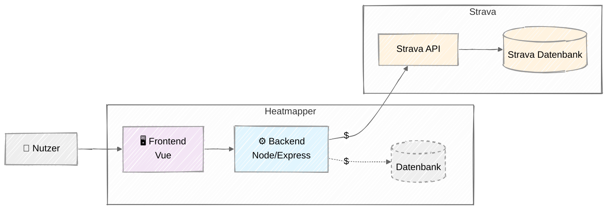
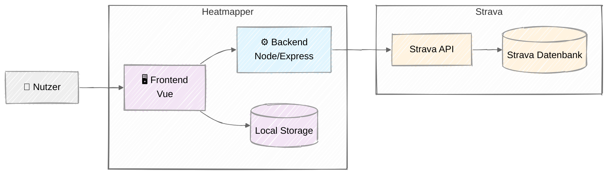
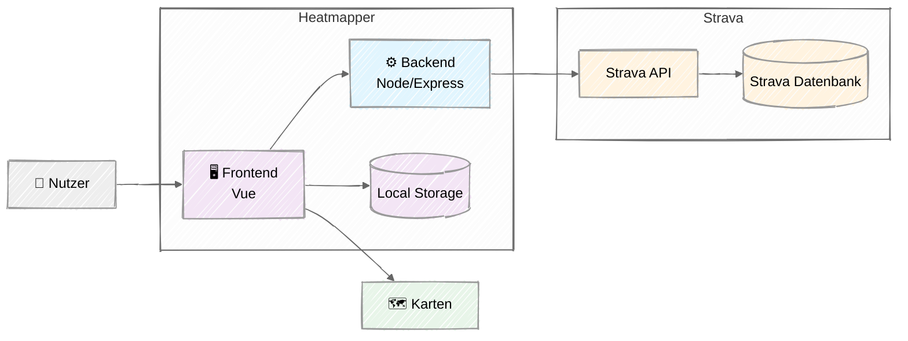
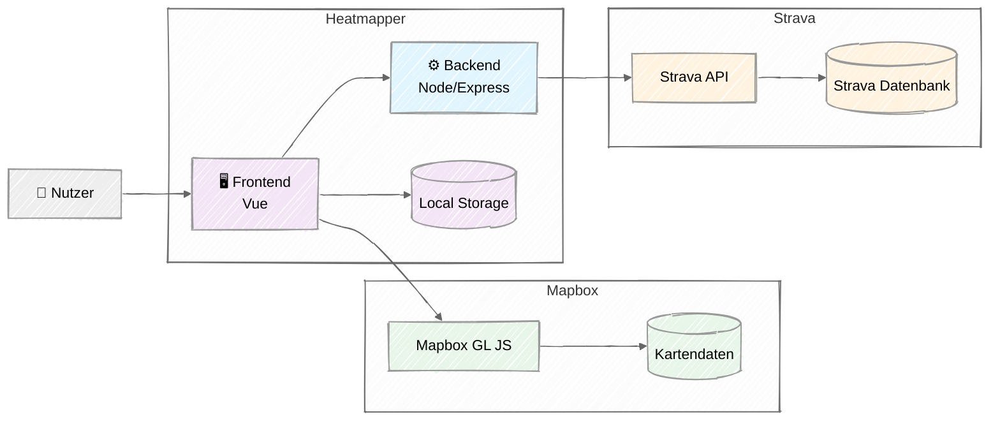

Von der manuellen Papierkarte zur programmatischen API-Integration

<!--
  In diesem Abschnitt schauen wir uns an, wie aus der analogen Papierkarte eine programmatische API-Integration wurde.
-->

---
title: Die Entscheidung für direkte API-Integration
inner-split: 50
---

## Warum nicht bei dérive bleiben?

### ❌ GPX-Export-Probleme
- DSGVO: Nur noch Massenexport alle Daten
- ZIP-Download und Import **auf Mobile fast unmöglich**
- Manuelle Schritte bei jeder Nutzung

::right::

<v-click>

## Die bessere Lösung

### ✅ Direkte API-Integration
- Strava hat eine öffentliche API
- Jeder kann direkt auf seine Daten zugreifen
- Ein-Klick-Zugriff ohne Downloads
- **Mobile-first möglich**
- Automatische Updates

</v-click>

<!--
  Warum bin ich nicht einfach bei dérive geblieben?
  Das Problem war der GPX-Export-Workflow.
  Durch die DSGVO gab es bei Strava nur noch einen Massenexport aller Daten – kein einzelner Export mehr.
  Das heißt: ZIP herunterladen, entpacken, importieren – auf dem Handy praktisch unmöglich.

  [click] Die bessere Lösung: Strava hat eine öffentliche API, über die man direkt auf seine Daten zugreifen kann.
  Ein Klick, kein Download, mobile-first möglich und automatische Updates.
-->

---
title: Erste technische Entscheidungen
inner-split: 50
---

## Brauchen wir ein Backend?

<v-click>

### Ja, aber minimal!

**Problem:** API-Token können nicht im Frontend gespeichert werden

**Lösung:** Backend nur für Token-Management
- **Strava OAuth-Flow** abwickeln  
- **API-Token sicher speichern**
- Session-Token an Frontend weiterreichen

</v-click>

::right::

<v-click>

## Architektur-Prinzip

### Backend: So wenig wie möglich
- Storage ist teuer, wenn die App skaliert

### Ergebnis
- Minimale Backend-Kosten

</v-click>

<!--
  Die nächste Frage war: Brauchen wir ein Backend?

  [click] Ja, aber so minimal wie möglich.
  API-Token dürfen nicht im Frontend gespeichert werden – das Backend übernimmt also nur den OAuth-Flow und das Token-Management.

  [click] Das Prinzip: So wenig Backend wie möglich, denn Storage wird teuer, wenn die App skalieren soll.
-->

---
title: Die Architektur im Überblick
articleClass: justify-center
---

<v-switch at="0">
<template #0>



</template>
<template #1>



</template>
<template #2>



</template>
<template #3>



</template>
<template #4>



</template>
<template #5>



</template>
<template #6>



</template>
</v-switch>

<!--
  Schauen wir uns nun die Architektur an.
  Im einfachsten Fall brauchen wir nur ein Frontend, ein Backend und eine Verbindung zur Strava-API.
  Diese API holt dann die Daten aus Stravas Datenbank.

  [click] Als Frontend habe ich Vue.js gewählt, da das 2020 die Frontend-Bibliothek war, mit der ich am meisten Erfahrung hatte.
  Das Backend läuft in Node.js, sodass ich Code für Datenstrukturen zwischen Frontend und Backend teilen kann.

  [click] Die Verbindung zu Strava hat ein Rate Limit und ist nicht besonders schnell.
  Das heißt, ich möchte wiederholte Anfragen minimieren – es würde also helfen, Caching in die Architektur einzubauen.

  [click] Ich könnte eine Datenbank ans Backend hängen, aber das würde bei Skalierung teuer werden und den Durchsatz im System erhöhen.

  [click] Inzwischen bieten moderne Browser gute Speichermöglichkeiten.
  Da die Daten eines einzelnen Nutzers nicht besonders groß sind, sollten sie in den Local Storage passen.

  [click] In diesem Diagramm fehlt noch etwas: Wir brauchen Karten.

  Das war kurz nachdem Google Maps sein Preismodell umgestellt hatte – das kostenlose Kontingent wurde massiv reduziert und die Kosten pro Seitenaufruf sind im Schnitt um das 14-fache gestiegen.
  Vielleicht erinnert ihr euch daran, wie plötzlich auf dutzenden Websites die Karten ausgegraut ware, mit der Meldung *„This page can't load Google Maps correctly.“*

  [click] Strava selbst war kurz zuvor ebenfalls auf eine Alternative umgestiegen: Mapbox.
  Mapbox hatte ein großzügiges kostenloses Kontingent – so großzügig, dass ich es bis heute nicht überschritten habe.
  Und es hatte den Vorteil, dass die Karten in Heatmapper genauso aussehen wie in Strava selbst.
-->

---
title: Was liefert die Strava-API?
inner-split: 55
---

### Übersichtsdaten statt GPS-Tracks

Die API liefert eine **Liste von Aktivitäten** — paginiert, bis zu 200 pro Request.

<v-click>

### Encoded Polylines

Die Route ist als **Encoded Polyline** kodiert: Ein kompaktes Textformat, das GPS-Koordinaten stark komprimiert.

Perfekt für Kartenvisualisierung: kein Detail-Endpoint nötig. Eine Aktivität ist jetzt bspw. 1,5 kB statt 3,6 MB.

</v-click>

::right::

````md magic-move {at: 0}
```json
// GET /api/strava/activities?per_page=200
[
  {
    "id": 1234567890,
    "name": "Lauf am Abend",
    "type": "Run",
    "distance": 10234.5,
    "moving_time": 3542,
    "start_date": "2024-03-15T18:25:12Z",
    "total_elevation_gain": 123.4,
    ...
  },
  ...
]
```
```json {11-13}
// GET /api/strava/activities?per_page=200
[
  {
    "id": 1234567890,
    "name": "Lauf am Abend",
    "type": "Run",
    "distance": 10234.5,
    "moving_time": 3542,
    "start_date": "2024-03-15T18:25:12Z",
    "total_elevation_gain": 123.4,
    "map": {
      "summary_polyline":
        "ys~fHi}~s@bCxIjE`NpBxGx@..."
    },
    ...
  },
  ...
]
```
````

<!--
  Was bekommt man eigentlich von der Strava-API?
  Keine GPX-Dateien – stattdessen ein Array von kompakten JSON-Objekten, eines pro Aktivität.
  Die Antwort ist paginiert: bis zu 200 Aktivitäten pro Anfrage.

  [click] Das Herzstück ist das Feld `map.summary_polyline`.
  Das ist eine Encoded Polyline (Google Polyline Algorithm) – ein von Google entwickeltes Format, das GPS-Koordinaten als kompakten ASCII-String kodiert.
  Eine Route mit hunderten Punkten wird zu einem kurzen String.
  Das ist genau das Format, das Kartenbibliotheken wie Mapbox direkt verstehen – kein Detail-Endpoint, keine großen Dateidownloads.

  Die Datenmenge pro Aktivität schrumpft dadurch von mehreren Megabyte auf wenige Kilobyte – perfekt für die Kartenvisualisierung.

  Wie ist das möglich? Die Encoded Polyline nutzt eine Kombination aus Delta-Kodierung (nur die Unterschiede zwischen Punkten speichern) und Base64-ähnlicher Kodierung, um die Daten stark zu komprimieren. Die Pünkte werden auch gefiltert: Wenn mehrere Punkte in einer geraden Linie liegen, werden die mittleren Punkte weggelassen, was die Datenmenge weiter reduziert.
-->

---
title: Learnings – API-getriebene Architektur
---

<v-clicks>

- **APIs schlagen Datei-Exports** — direkter Zugriff ist robuster, nutzerfreundlicher und DSGVO-konformer

- **Nur das abrufen, was man braucht** — Summary-Daten reichen; kein Detail-Endpoint, keine riesigen Dateidownloads

- **Backend so minimal wie möglich** — Zustand gehört zum Client, nicht zum Server

- **Externe Abhängigkeiten haben Kosten** — Rate Limits, Pricing-Änderungen und Compliance-Anforderungen müssen eingeplant werden

- **Externe Änderungen erzwingen Anpassungen** — wer auf fremde APIs baut, baut auf fremden Entscheidungen. Kein Interface-Contract, kein SLA, der Pricing oder Datenstruktur festschreibt — Strava bestimmt.

</v-clicks>

<!--
  Fassen wir die wichtigsten Learnings zusammen.

  [click] APIs sind Datei-Exporten klar überlegen – robuster, direkter und unabhängig von manuellen Schritten.

  [click] Man sollte nur das abrufen, was man wirklich braucht. Summary-Daten mit Encoded Polylines reichen für eine Heatmap völlig aus.

  [click] Das Backend bleibt minimal – Zustand, der nur einen Nutzer betrifft, gehört in den Browser, nicht auf einen Server.

  [click] Externe Abhängigkeiten haben immer Kosten: Rate Limits, Gebühren, API-Versionierung. Das muss von Anfang an in die Architektur einfließen.

  [click] Und schließlich: Wer auf fremde APIs und Dienste baut, muss mit externen Änderungen rechnen – und die Architektur so gestalten, dass man darauf reagieren kann.
-->

