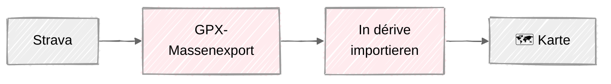
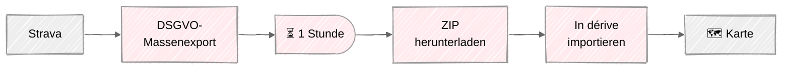

Von der manuellen Papierkarte zur programmatischen API-Integration

<!--
Wir haben also das Problem erkannt.
  Aber *wie* wurde aus der analogen Papierkarte eine programmatische API-Integration?
-->

---
title: 'Der Wendepunkt: Von analog zu digital'
split: 60
right:
  image: /media/derive.jpg
  pageClass: bg-[position:33%]
  articleClass: text-white flex flex-col justify-end text-right
  full-color: true
---

### Der Auslöser

Entdeckung des Projekts <SmartLink to="github.com/erik/derive">**dérive**</SmartLink> — ein Open-Source-Projekt, das GPX-Dateien auf einer Karte darstellt

::blockquote{.font-serif.my-2}
**GPX**  
_GPS Exchange Format_. XML-basiertes Dateiformat für GPS-Tracks
::

::right::

(<SmartLink to="https://github.com/erik/derive"><mdi-github/> erik/derive</SmartLink>)

<!--
Den ersten Anstoß hat mir dérive gegeben — ein Open-Source-Projekt, das GPX-Dateien auf einer Karte darstellt.
  Gefühlt war es genau das, was ich gesucht habe. Aber in der Praxis gab es ein Problem.
-->

---
title: Die Entscheidung für direkte API-Integration
articleClass: justify-around
---

= 2 }">

### GPX-Export (dérive)

<v-switch>
<template #0>

```mermaid
---
config:
  look: handDrawn
  theme: neutral
---

flowchart LR
  Strava[Strava] --> Export[GPX-\nMassenexport]
  Export --> Import[In dérive\nimportieren]
  Import --> Karte[🗺️ Karte]

  classDef bad fill:#ffebee
  class Export,Warten,ZIP,Entpacken,Import bad
```

</template>
<template #1-3>

```mermaid
---
config:
  look: handDrawn
  theme: neutral
---

flowchart LR
  Strava[Strava] --> Export[DSGVO-\nMassenexport]
  Export --> Warten@{ shape: delay, label: "⏳ 1 Stunde" }
  Warten --> ZIP[ZIP\nherunterladen]
  ZIP --> Import[In dérive\nimportieren]
  Import --> Karte[🗺️ Karte]

  classDef bad fill:#ffebee
  class Export,Warten,ZIP,Entpacken,Import bad
```

</template>
</v-switch>

### Direkte API-Integration

```mermaid
---
config:
  look: handDrawn
  theme: neutral
---

flowchart LR
  Strava[Strava] --> API[Strava API]
  API --> Heatmapper[Heatmapper]
  Heatmapper --> Karte[🗺️ Karte]

  classDef good fill:#e8f5e9
  class API,Heatmapper good
```

<!--
dérive basiert auf GPX-Dateien — man muss also seine Daten aus Strava exportieren.

  [click] Durch die DSGVO gab es aber nur noch einen Massenexport aller Daten – nicht nur GPX-Daten.
  Das heißt: eine Stunde warten, ZIP herunterladen, entpacken, importieren – auf dem Handy praktisch unmöglich.

  [click] Die bessere Lösung: Strava hat eine öffentliche API, über die man direkt auf seine Daten zugreifen kann.
  Ein Klick, kein Download, mobile-first möglich und automatische Updates.
-->

---
layout: end
---

Q&A

